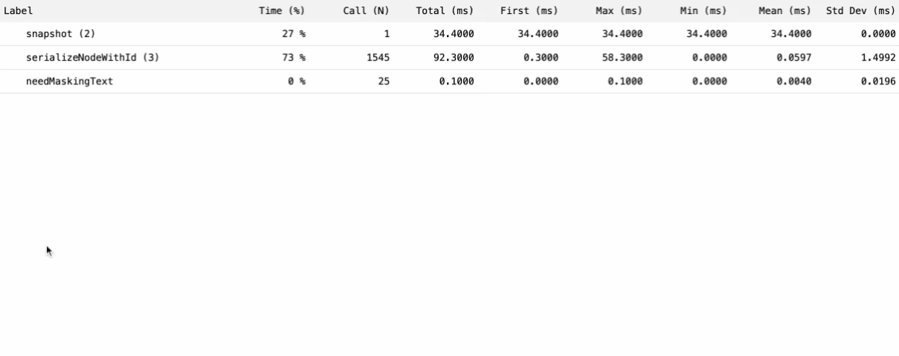

# Structural JavaScript Profiler

See about [structural and sampling](https://www.igvita.com/slides/2012/structural-and-sampling-javascript-profiling-in-chrome.pdf) JavaScript profiling.  

`trace` is a JavaScript library for measuring code execution time.  
It provides a simple way to benchmark code, allowing measurement of the performance of individual functions and nested calls. 

Wrap the code to benchmark with the `on(label)` and `off(label)` functions.
```
trace.on("my function 1")
// your code
trace.off("my function 1")
```

Benchmarking can be structured as a nested hierarchy of `on`/`off` calls.
```
trace.on("my function 1")
    trace.on("inner function", { skip: 10, take: 100 })
    // your code
    trace.off("inner function")
trace.off("my function 1")
```

To generate an execution report, call the `trace.report()` method from the code or dev tools console.  
This will open a popup window with an expandable table representing the call hierarchy and benchmarks. 

### Install
```
<script src="https://ababik.github.io/trace/trace.js"></script>
```
`trace` objest is available as a global variable.

### Report Example
